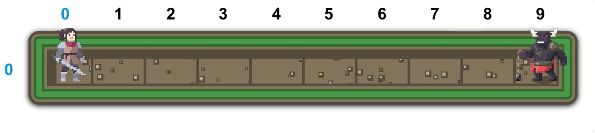
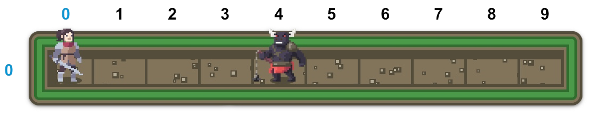
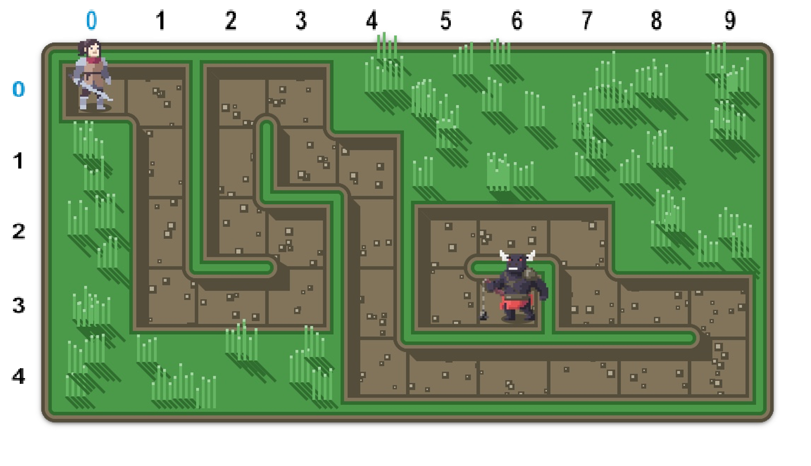
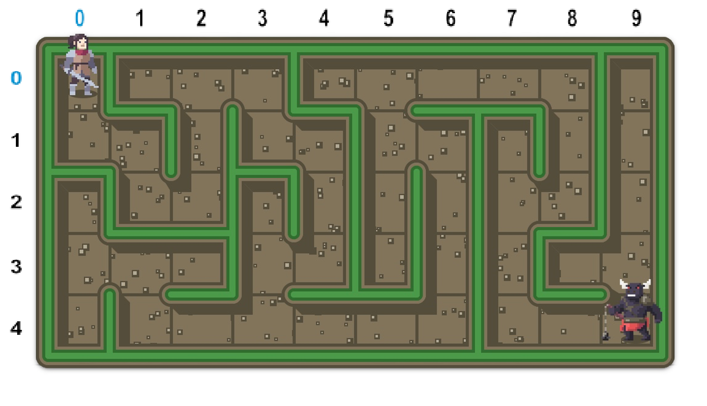
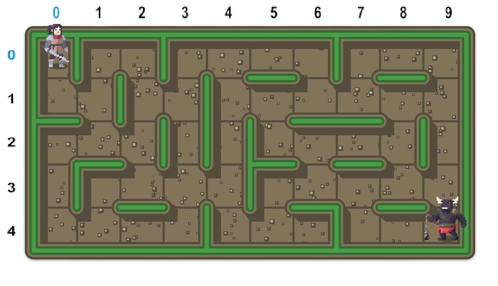

# How to run
This is `mazemastery`, a Python package that allows you to conquer mazes of various shapes using the power of coding!

You can read all about `mazemastery` in great length in [our paper](https://zenodo.org/records/8431922). This short guide covers only the basics and will help you to set up `mazemastery` on your device as fast as possible.

You can use your favourite IDE (or text editor), but we assume you have set up a Python 3 (and `pip`) with VS Code.

## Installing `mazemastery`
Open your terminal and type:
```
python3 -m pip install mazemastery
```
Done!

## Running `mazemastery`
To run `mazemastery`, all you need is a Python file with the following content:
```python
from mazemastery.api import *

def my_solution():
    # My code to solve the maze goes here!
    pass

run(level=0, solve=my_solution, delay=100, cell_size=100, rows=11, cols=11)
```
Let's go over it. The first line imports all functions from the `mazemastery` API, which allow you to control the protagonist in the maze. If you don't like the `*`-import, you can also import only the functions you need.

Then you can define a function that `mazemastery` will use to try and solve the maze. The function does not need to take any arguments.

The last line contains the `run` command imported from `mazemastery.api`. It manages the creation and visualization of the maze, and runs your code to see if you managed to reach the Minotaur. Its arguments have the following meaning:
- `level`: This is the level number you'd like to attempt, ranging from 1-6 (easiest to hardest).
- `solve`: This is the function that will be run on the maze. Remember that in Python, functions can be defined and used like variables. Here, you can just type the name of the function that contains your code (`my_solution`), which passes this function as an argument.
- `delay`: The delay in milliseconds between frames (so `delay=1000` means one second). Increase this value to slow down the visualization and vice versa.
- `cell_size`: The size of a single cell of the maze in pixels.
- `rows` and `cols`: The number of rows and columns in the maze respectively.

Running the code above will open up the first and simplest level:


# All levels

In the second level, the column-position of the minotaur is randomized.


The third level is a corridor with randomized turns.


The fourth level includes dead-ends.


The fifth level features dead-ends and cycles.

# Example solutions and student attempts
Example solutions for all levels can be found in `./src/level<level_nr>.py`, where `<level_nr>` indicates the level number. Student attempts from our user study can be found in `./src/student_solutions.py`.

# Feedback and Improvements
We would love to hear your feedback. If you find a bug or have an idea for an improvement, please open up a new issue.
